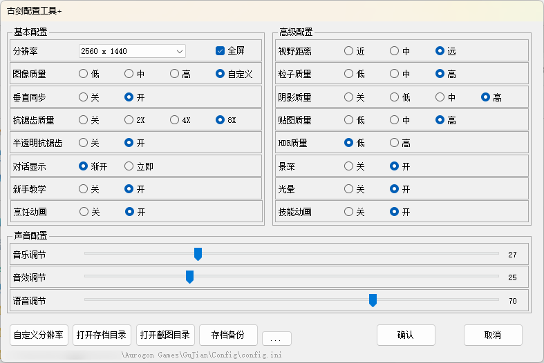

# 《古剑奇谭》游戏配置工具

基于 steam 游戏版本 1.1.8.1 制作

## 示意图：

## 使用说明：

下载后，直接打开选择合适自己的分辨率，点击确定即可。

如果列出的分辨率都不合适，可以点击自定义分辨率。

## 更新说明：

2025年5月
添加分辨率从大到小排序
调整关于窗口的大小

2022年3月
添加配置文件路径显示

2021年8月
分辨率：
默认获取当前显示器支持的分辨率，也就是系统设置中显示分辨率。
如果找不到要用的分辨率，可以使用“自定义分辨率”功能，手动输入分辨率的宽和高

新增配置显示：
【对话显示；新手教学；烹饪动画；技能动画】：
原先这些功能需要手动改配置数据或进游戏中操作，现在直接做到面板中可见。

新增按钮功能：
【自定义分辨率】：点击可以切换“基本设置”中的分辨率操作方式。
【打开存档目录】：浏览存档文件。
【打开截图目录】：浏览游戏截图，目录不存在时会自动创建。截图快捷键：PrtSc
【存档备份】：将存档目录拷贝到所指定的文件夹下面。

基于Steam版本制作，无意外会和其他版本通用~

作者：夜潇
